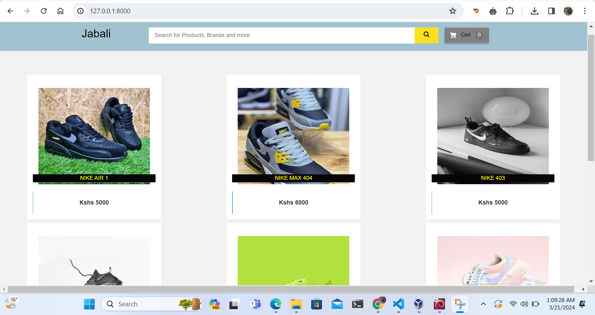
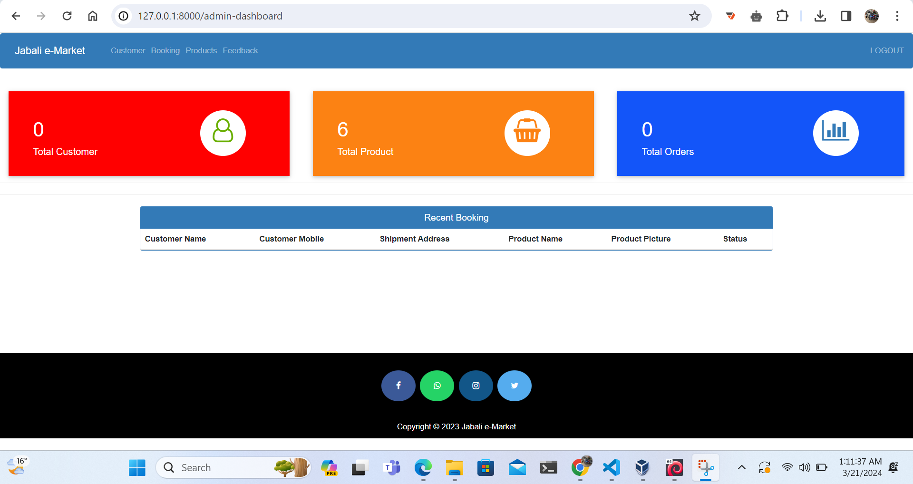

# Jabali e-Martket
Jabali, the e-market app, is poised to revolutionize the online shopping experience by offering a seamless platform for buyers and sellers alike. With a user-friendly interface and robust features, Jabali enables users to browse a diverse range of products, place orders securely, and make payments conveniently through popular methods like M-pesa and Airtel Money. Designed with mobile responsiveness in mind, Jabali ensures accessibility across various devices, catering to the evolving needs of modern consumers. Sellers can showcase their products with detailed listings, attracting potential buyers with compelling descriptions and high-quality images. With a commitment to customer satisfaction, Jabali provides responsive support channels and fosters a culture of feedback-driven improvement. Through strategic marketing efforts and continuous iteration, Jabali aims to become the go-to destination for online shopping, delivering value and convenience to users in its target market.

## Landing Page


## Jabali is an ecommerce app that allows the following

- User Authentication: Allow users to create accounts, log in, and log out securely.
- Product Catalog: Display a list of products with images, titles, descriptions, and prices. Users should be able to browse through different categories.
- Product Details: When a user clicks on a product, they should be taken to a detailed view showing more information about the product.
- Shopping Cart: Allow users to add products to their cart and view the items they have added. They should be able to adjust quantities and remove items.
- Checkout Process: Guide users through a simple checkout process where they can enter shipping and payment information. For simplicity, you might integrate with a payment gateway like Stripe for handling transactions.
- Order History: After a purchase is completed, users should be able to view their order history and track the status of their orders.
- User Profile: Allow users to view and edit their profile information, including shipping addresses and payment methods.
- Search Functionality: Implement a basic search feature to allow users to find products by name or category.
- Responsive Design: Ensure the app works well on different devices, including smartphones, tablets, and desktops.
- Basic Admin Panel: Create a simple backend interface for managing products, orders, and user accounts. This is primarily for the administrator to add, update, or remove products as needed.
- Notifications: Send email notifications to users for order confirmation, shipment tracking, etc.
- Reviews and Ratings: Allow users to leave reviews and ratings for products they have purchased.

## Admin Dashboard


## FUNCTIONS
## Customer
- Customer can view/search products without login.
- Customer can also add/remove product to cart without login (if customer try to add same product in cart. It will add only one)
- When customer try to purchase product, then he/she must login to system.
- After creating account and login to system, he/she can place order.
- There is a payment page also (just for demo, DONT FILL YOUR CARD DETAILS THERE ,By the way, website do not save that details)
- If customer click on pay button, then their payment will be successful and their order will be placed.
- Customer can check their ordered details by clicking on orders button.
- Customer can see the order status (Pending, Confirmed, Delivered) for each order  
- Customer can Download their order invoice for each order
- Customer can send feedback to admin (without login)
---
### Admin
- First admin will login ( for username/password run following command in cmd )
```
py manage.py createsuperuser
```
- Give username, email, password and your admin account will be created.
- After login, there is a dashboard (attached in screenshot) where admin can see how many customer is registered, how many products are there for sale, how many orders placed.
- Admin can add/delete/view/edit the products.
- Admin can view/edit/delete customer details.
- Admin can view/delete orders.
- Admin can change status of order (order is pending, confirmed, out for delivery, delivered)
- Admin can view the feedbacks sent by customers.
---
### Other Features
- customer places order and admin deleted that user(fraud detection), then their orders will automatically deleted

- suppose 1 customer places 4 products order and admin deleted 2 product from website, then that 2 product order will
    also be deleted and other 2 will be their
- If user click on purchase button without having products in their cart, then website will ask to add product in cart first.


## HOW TO RUN THIS PROJECT
- Install Python(3.12.2) (Dont Forget to Tick Add to Path while installing Python)
- Open Terminal and Execute Following Commands :
```
pip install django==3.7.2
pip install django-widget-tweaks
pip install xhtml2pdf

```
- Download This Project Zip Folder and Extract it
- Move to project folder in Terminal. Then run following Commands :
```
py manage.py makemigrations
py manage.py migrate
py manage.py runserver
```
- Now enter following URL in Your Browser Installed On Your Pc
```
http://127.0.0.1:8000/
```

## CHANGES REQUIRED FOR CONTACT US PAGE
- In settins.py file, You have to give your email and password
```
EMAIL_HOST_USER = 'youremail@gmail.com'
EMAIL_HOST_PASSWORD = 'your email password'
EMAIL_RECEIVING_USER = 'youremail@gmail.com'
```
- Login to gmail through host email id in your browser and open following link and turn it ON
```
https://myaccount.google.com/lesssecureapps
```

## Disclaimer
This project is developed for demo purpose and it's not supposed to be used in real application.

## Contributor
- [Stan Anyumba](https://github.com/anyumbake)
